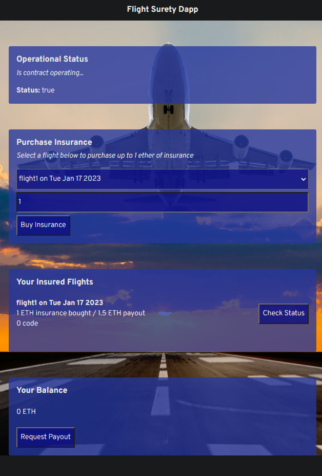

# FlightSurety

FlightSurety is a sample application project for Udacity's Blockchain course.

## Install (using Docker)

<code>docker build -t flight1 .</code> 
<code>docker run -t -d -p 9545:9545 -p 8000:8000 flight1</code>

### Running inside the container ...

You might want to check the container ID 

<code>docekr ps</code>

Get iside the container

<code>docker exec -it [contaner id] bash</code>

Inside the container run truffle

<code>truffle develop</code>
<code>compile</code>
<code>migrate --reset</code>

Try to run testings again if any test fails

<code>test</code>

Another path to test wothout entering truffle cli

<code>truffle compile</code>
<code>truffle test test/flightSurety.js</code>
<code>truffle test test/oracles.js</code>

### runnig the app

For this step we will need 2 terminals one for one to start truffle and another to run the dapp

In one terminal type <code>truffle develop</code>
<code>migrate</code>

On another terminal type
<code>npm run dapp</code>

http://localhost:8000/

<figcaption>Dapp UI</figcaption>

You maight face different issues while using the Dapp UI, but you can try...

* Resetting the metamask account.

* Doing truffle migrate --reset

* Refreshing the Dapp UI

## Depelop server

First reset truffle artifacts

<code>truffle develop</code>

you can test oracles (you may try a few times if you can't get to pass all testings)

<code>npm run server</code>

<code>truffle test test/oracles.js</code>

## Deploy

To build dapp for prod:

<code>npm run dapp:prod</code>

Deploy the contents of the ./dapp folder

