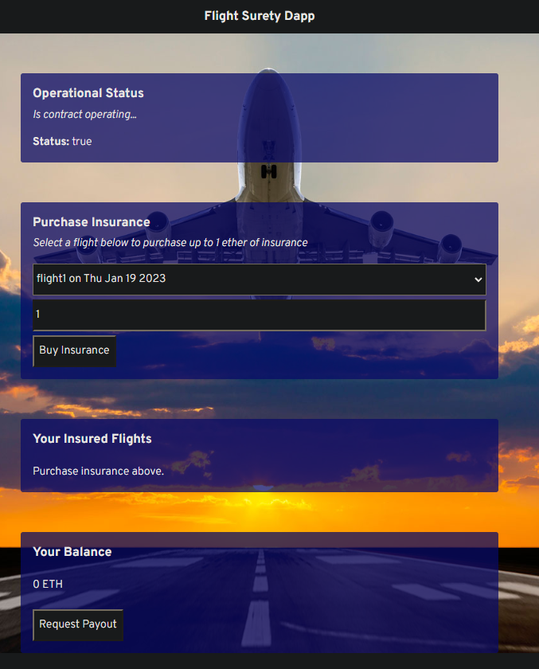

# FlightSurety

FlightSurety is a sample application project for Udacity's Blockchain course.

## Install (using Docker)

<code>docker build -t flight1 .</code> 
<code>docker run -t -d -p 9545:9545 -p 8000:8000 flight1</code>

### Running inside the container ...

You might want to check the container ID 

<code>docekr ps</code>

Get iside the container

<code>docker exec -it [contaner id] bash</code>

When you are inside the container run truffle

<code>truffle compile</code>
<code>compile</code>
<code>migrate --reset</code>

Try to run testings again if any test fails

<code>test</code>

Another path wothout entering truffle cli

<code>truffle develop</code>
<code>truffle test ./test/flightSurety.js</code>
<code>truffle test ./test/oracles.js</code>

### runnig the app

I recommend you to open a new terminal window and type

<code>truffle migrate</code>
<code>npm run dapp</code>

http://localhost:8000/

* If you have an error like "incorrect nounce" try resetting the metamask account.

<figcaption>Dapp UI</figcaption>

## Depelop server

First reset truffle artifacts

<code>truffle develop</code>

you can test oracles (you may try a few times if you can't get to pass all testings)

<code>npm run server</code>

<code>truffle test test/oracles.js</code>

## Deploy

To build dapp for prod:

<code>npm run dapp:prod</code>

Deploy the contents of the ./dapp folder

